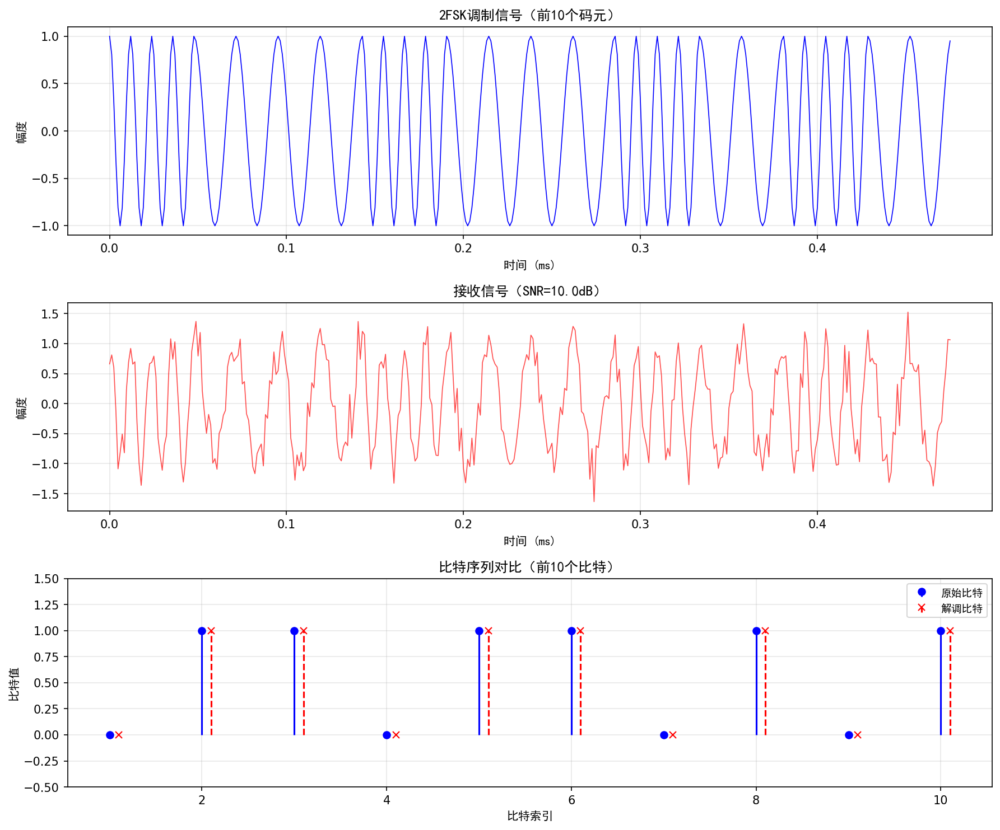
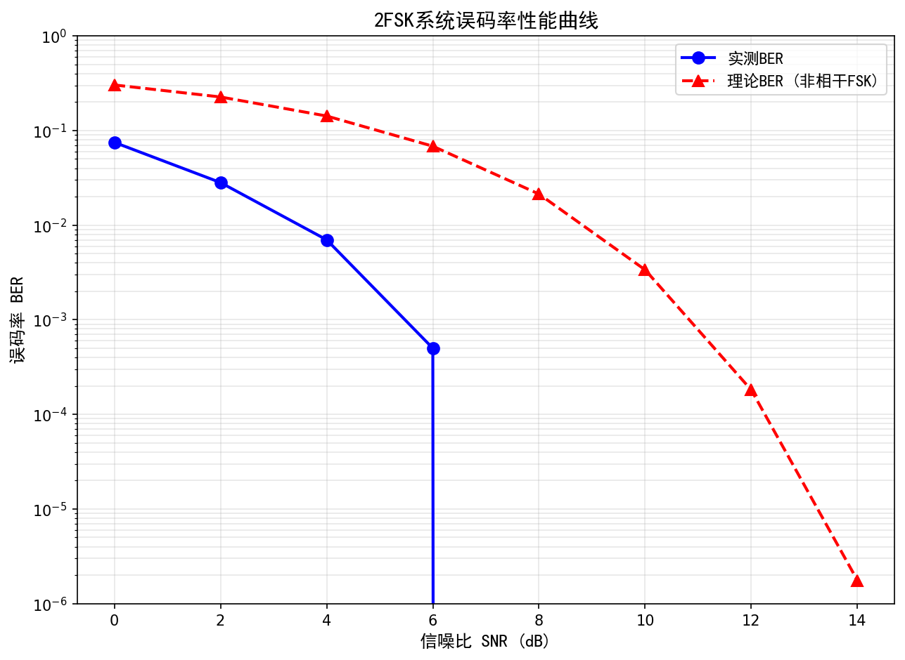
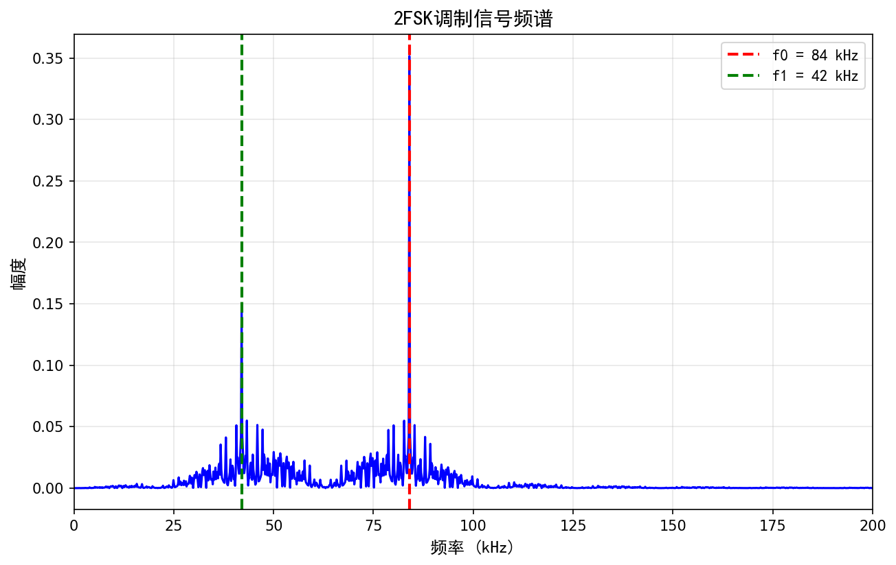

# 2FSK调制解调系统 - 快速开始

本指南整合了命令行与图形模式的使用方法，帮助你在 MWORKS Syslab 中快速运行项目。

## 系统要求

- **MWORKS Syslab 2025b** 或更高版本（内置 Julia 1.9.3）
- Julia 包：DSP、FFTW、SpecialFunctions、Statistics、PyPlot（自动安装）

## 路径与环境配置

项目使用 `<PROJECT_ROOT>` 占位符，请在运行前替换为实际路径。

```julia
# 设置项目根目录（示例）
PROJECT_ROOT = "D:/Projects/2FSK_System"  # 修改为你的路径
cd(PROJECT_ROOT)
```

Windows 下可使用如下任意形式：
- `"D:/Projects/2FSK_System"`（推荐）
- `"D:\\Projects\\2FSK_System"`

首次运行前完成以下检查：

- [ ] 替换 `<PROJECT_ROOT>` 为真实路径
- [ ] Julia ≥ 1.6 且 MWORKS Syslab 已安装
- [ ] `install_pyplot.jl` 已执行
- [ ] `main.jl` 可成功运行

## 快速运行（命令行模式）

`main.jl` 会自动检测 PyPlot 是否可用：若未安装，将仅生成 CSV 数据文件。

```julia
# 进入项目目录（修改为实际路径）
cd("<PROJECT_ROOT>/2FSK_System")

# 首次运行安装 PyPlot（只需一次）
include("install_pyplot.jl")

# 启动主程序
include("main.jl")
```

默认参数：
- 传输信息：`"测试251113"`
- 码元速率：21 kBaud
- 信道：AWGN，SNR = 10 dB

程序完成后会生成以下文件：
- `ber_data.csv`、`spectrum_data.csv`
- （若 PyPlot 可用）`waveforms.png`、`ber_curve.png`、`spectrum.png`

## 图形模式（PyPlot 可用时）

在成功安装 PyPlot 后，`main.jl` 会进入全图形模式。运行步骤与命令行模式相同，额外输出高质量图像，适合论文或展示使用。

### 图形示例







## 常见问题

### PyPlot 安装失败？

```julia
ENV["PYTHON"] = ""      # 使用 Conda.jl 自带的 Python
using Pkg
Pkg.add("PyCall")
Pkg.build("PyCall")
Pkg.add("PyPlot")
```

如仍失败，可暂时跳过安装，程序会自动降级为数据文件模式。

### 没有生成图片？

查看控制台是否提示 PyPlot 未安装。只要安装成功并重新运行 `main.jl` 即可生成 PNG。

### 如何自定义参数？

在 `main.jl` 顶部修改：

```julia
const MESSAGE = "你的测试文本"
const SYMBOL_RATE = 21e3
const SNR_TEST = 12.0
snr_range = 0:2:14
```

更改后重新运行 `main.jl`。
